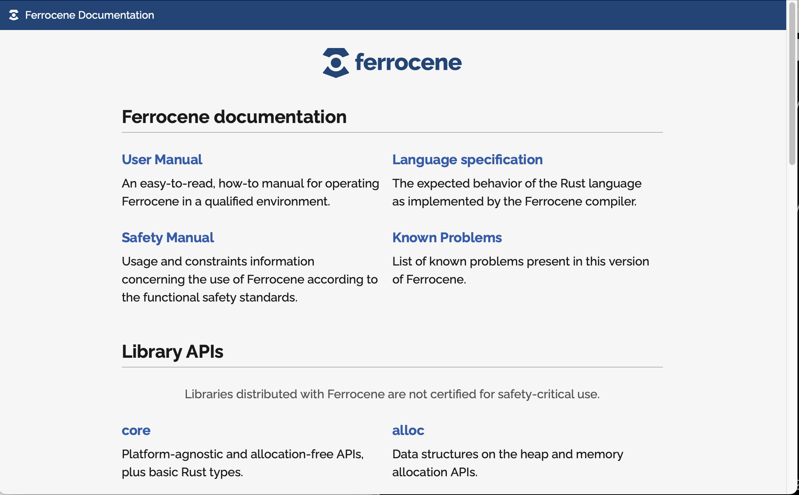
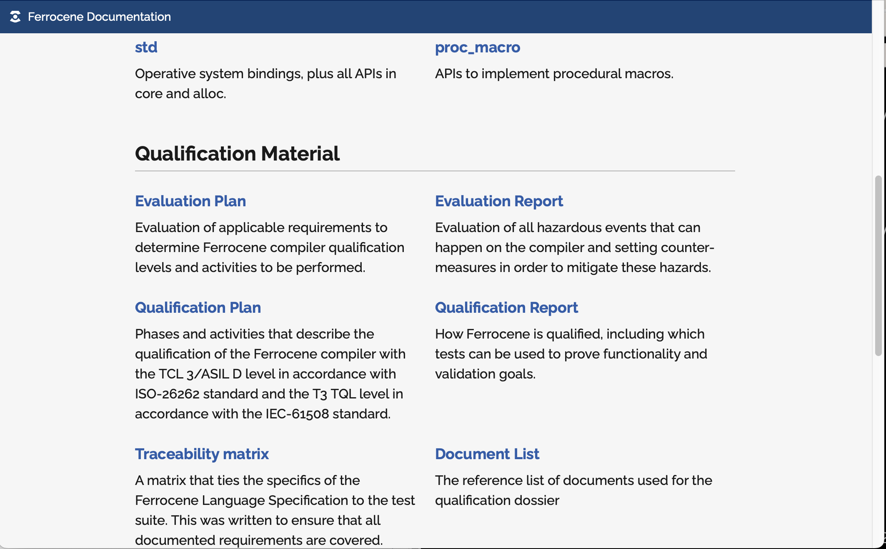
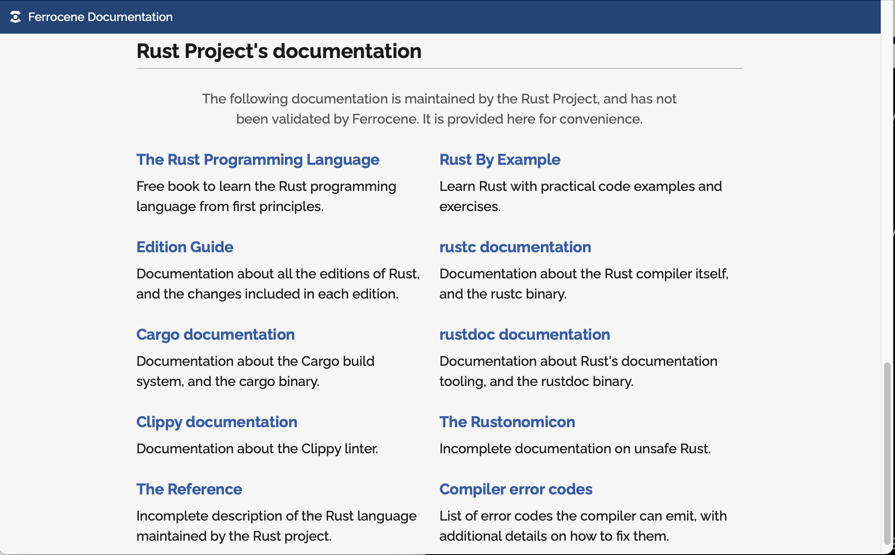

# Exploring the installation

## What do you get?

```console
$ ls -F /opt/ferrocene-23.06
bin/  etc/  lib/  libexec/  share/
$ ls -F /opt/ferrocene-23.06/bin
cargo*  ferrocene-self-test*  rust-gdb*  rust-gdbgui*  rust-lldb*  rustc*  rustdoc*
$ ls -F /opt/ferrocene-23.06/etc
bash_completion.d/
$ ls -F /opt/ferrocene-23.06/lib
librustc_driver-c3ee1e25139c0393.so  libstd-8aa647671c2dc036.so
libtest-eab3dde10cbeff80.so          rustlib/
$ ls -F /opt/ferrocene-23.06/libexec
cargo-credential-1password*  rust-analyzer-proc-macro-srv*
$ ls -F /opt/ferrocene-23.06/share
doc/ man/ zsh/
```

## Is that docs?

```console
$ ls -F /opt/ferrocene-23.06/share/doc/
cargo/  ferrocene/  rust/
$ ls -F /opt/ferrocene-23.06/share/doc/cargo/
LICENSE-APACHE  LICENSE-MIT  LICENSE-THIRD-PARTY  README.md
$ ls -F /opt/ferrocene-23.06/share/doc/rust/
COPYRIGHT  LICENSE-APACHE  LICENSE-MIT  README.md
$ ls -F /opt/ferrocene-23.06/share/doc/ferrocene/
html/
$ open /opt/ferrocene-23.06/share/doc/ferrocene/html/index.html
```

---



---



---


