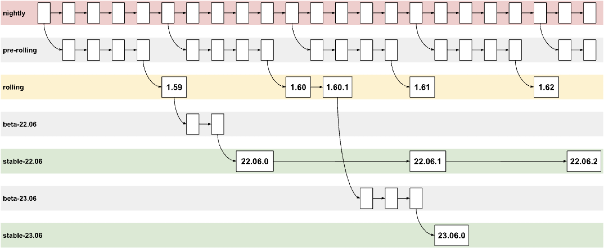

# Commercial Support

## Ferrocene is open source

* The Source Code is MIT/Apache-2.0
* The [Ferrocene Language Specification] is MIT/Apache-2.0
* You can even read the unsigned Qualification Documents

[Ferrocene Language Specification]: https://spec.ferrocene.dev

## And you sell?

* Long-term Support
  * for Ferrocene
  * for third-party crates (as an add-on)
* Includes digitally-signed Qualification Documents for your assessor

## How long is long-term?

* Upstream Rust only supports each release for six weeks
* There are no backports to old stable releases
* We pick a *rolling* release, *stabilise* it, and support it for 2 years
  * We give subscribers bug-fix releases as we fix bugs
* After 2 years you go into Extended Support
  * We tell subscribers about issues and give possible workarounds

## Roadmap

Note:

What upstream calls *stable* we rename to *rolling*. What they call *beta* we
call *pre-rolling*.

## How much is it?

* Currently $3000 per year per user

## Is there a USB dongle?

* No
* You get a username and password to a download area
* You (will) get a tool `criticalup` for downloading your binaries
* Your binaries are legally restricted but not physically restricted
  * They are designed to be used in your CI system!
